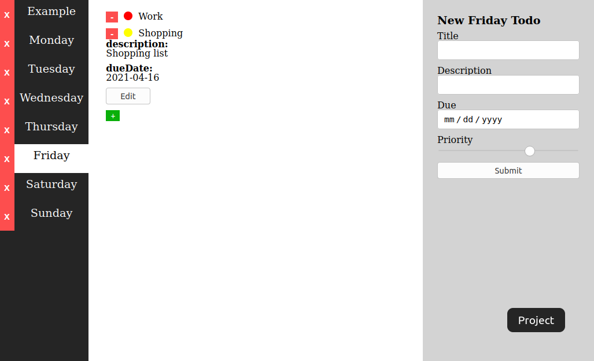

# Todo-list

A simple Todo app where a user can:
- Create Projects
- Create Todos for each project
- Edit Todos
- Remove Projects or Todos

## [Live Link](https://helman101.github.io/Todo-list/)

## Built With

- JavaScript
- HTML
- CSS

## Getting Started

To set up a local copy of the project

- `git clone git@github.com:helman101/Todo-list.git`
- `cd Todo-list`
- `npm install`

## Author

👤 **Andres Ortegon**

- GitHub: [@helman101](https://github.com/helman101)
- Twitter: [@helman1011](https://twitter.com/Helman1011)
- LinkedIn: [Andres Ortegon](https://www.linkedin.com/in/helman101/)

👤 **Patrikis Angelos**

- GitHub: [@patrick-angelos](https://github.com/patrick-angelos)
- Twitter: [@AngelosPatrikis](https://twitter.com/AngelosPatrikis)
- LinkedIn: [Angelos Patrikis](https://www.linkedin.com/in/angelos-patrikis-a590a61b5/)

## 🤝 Contributing

Contributions, issues, and feature requests are welcome!

## Show your support

Give a ⭐️ if you like this project!

## Acknowledgments

- To Microverse for their `README` template.

## 📝 [License](LICENSE)
